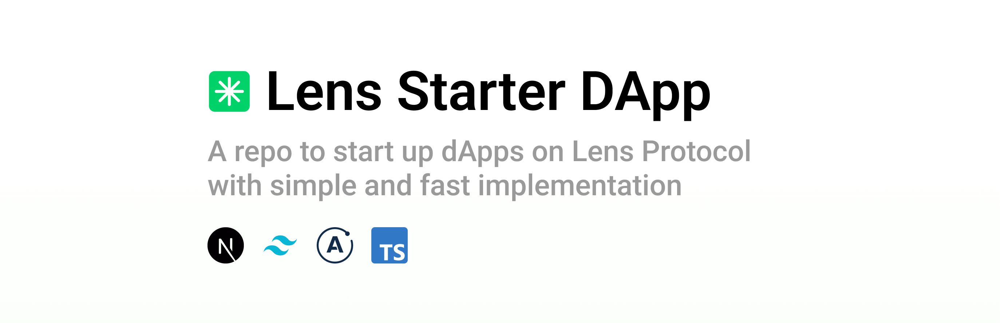

# \*️⃣ Lens Starter dApp



<br/>

Lens Starter dApp is a repo to be forked/cloned/copied that is a useful starting point to build projects on [Lens Protocol](https://https://docs.lens.xyz/).

What this repo includes:

- Main project layout and structure
- Various and most used utility functions in
- A set of most used queries to the Lens API
- A simple implementation example (auth + profile fetch)
- Baseline React Context API implementation
- Some baseline elements for other features

## How to use the repo

You can run and test the repo by running:

```
yarn
yarn dev
```

Create yourself a `.env.local` file with the following entries:

```
NEXT_PUBLIC_IS_MAINNET=
NEXT_PUBLIC_IS_STAGING=
NEXT_PUBLIC_INFURA_SECRET=
NEXT_PUBLIC_INFURA_PID=
```

Then you can add/remove/keep the queries defined in `/graphql` and run:

```
yarn generate
```

This will run a GraphQL codegen that will generate all needed types + hooks that you can use to query the API.
